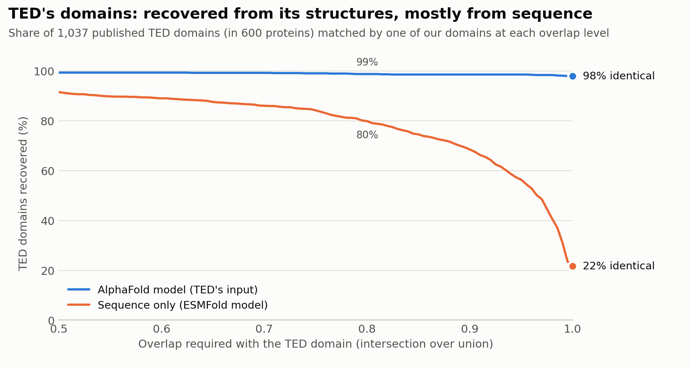
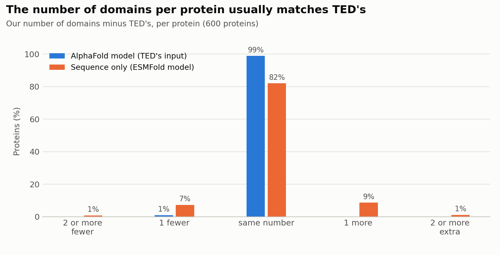
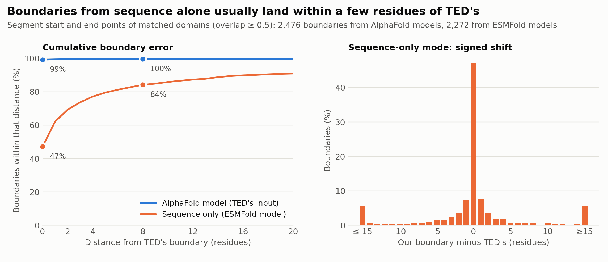
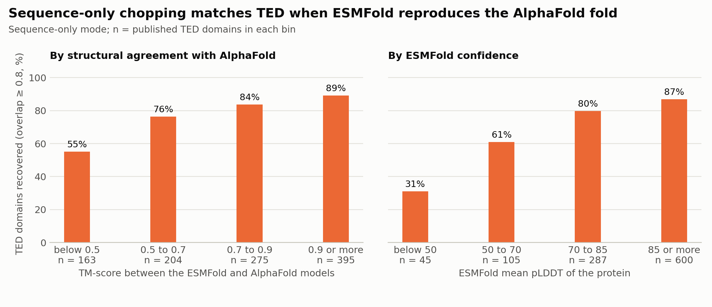
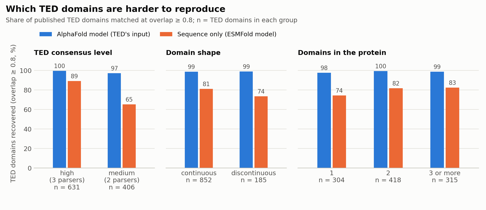
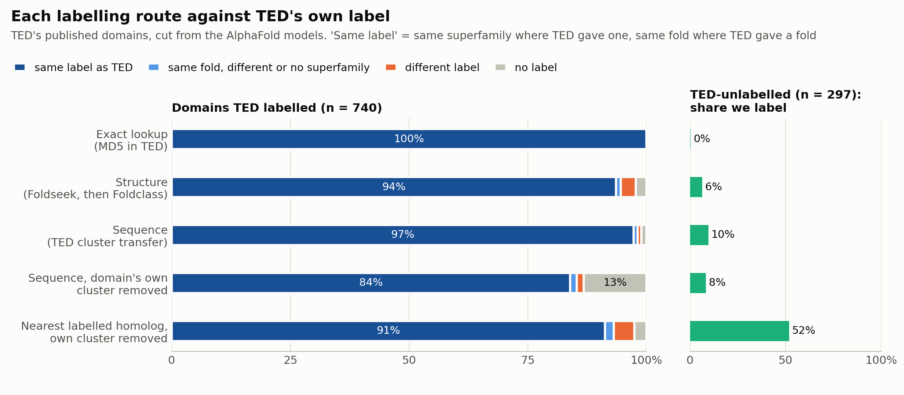
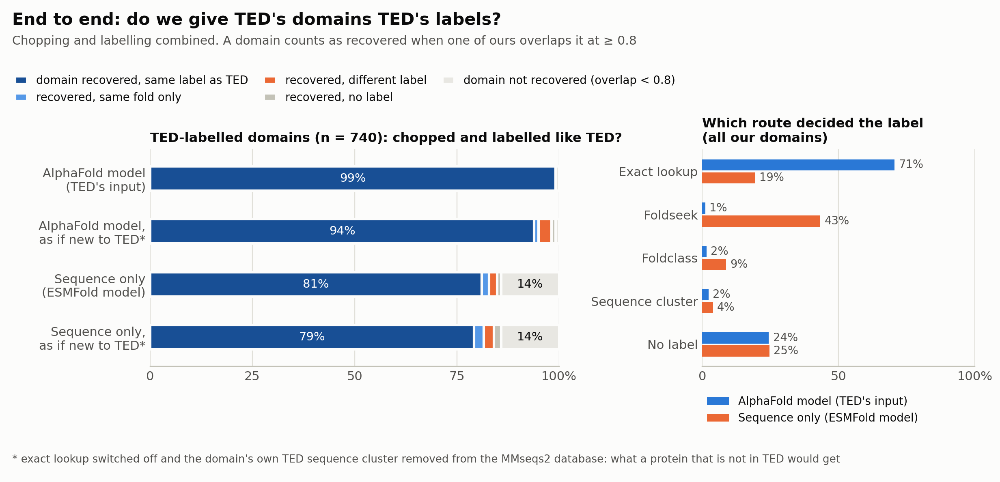
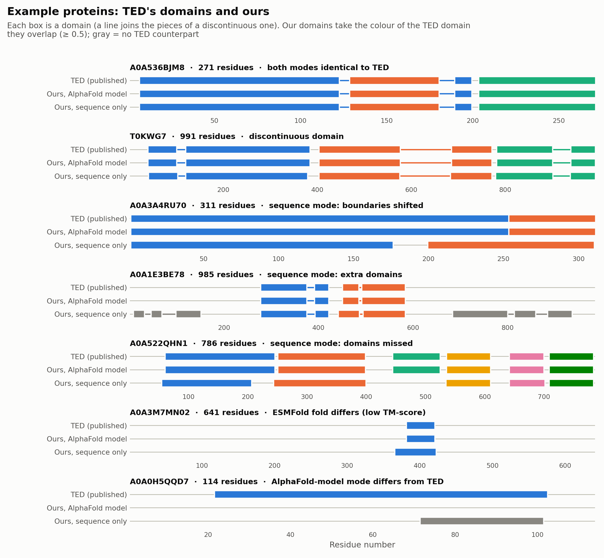

# Benchmark: our TED functions against TED's published results

Run on 2026-10-01. Everything here is regenerated by the numbered scripts in this folder; the tables at the end are
written by `06_report.py`. The inputs and outputs of the run are not in git.

## What was tested

- **Proteins.** 600 TED-100 proteins drawn at random from the whole TED database (hash-sampled over all 365M rows,
  not just one accession range), 36–991 residues, with **1,037 published TED domains**. The sample mirrors TED:
  61% high-consensus domains; 57% with a superfamily label, 14% with a fold label, 29% unlabelled.
- **Two ways of running `ted_chop` on the same proteins.**
  - *AlphaFold model*: the AFDB model TED itself chopped. This tests whether our pipeline is TED's pipeline.
  - *Sequence only*: the sequence is folded with ESMFold, then chopped. This is what happens for a new sequence.
- **`cath_label`** on three sets of domains: TED's own published domains, and our domains from each mode. Each
  labelling route (exact lookup, structure, sequence) is scored separately against TED's label.
- **"As if new to TED".** Proteins in this benchmark are in TED, so the exact lookup and the domain's own sequence
  cluster hand back TED's answer. To estimate behaviour on a protein TED has never seen, we also score a variant with
  the exact lookup switched off and the domain's own TED cluster removed from the sequence database.

No protein failed in either mode.

## Findings

1. **From TED's structures we reproduce TED.** 98.0% of the published domains come out with identical residue ranges
   and 96.8% of proteins are identical in every domain. The rest come from the parsers: for a few proteins our
   Merizo, Chainsaw or UniDoc output differs from the one TED published.
2. **From sequence alone we recover most domains, with looser boundaries.** 79.8% of TED's domains are matched at
   overlap ≥ 0.8 and 91.5% at ≥ 0.5, but only 21.7% are residue-identical. 82% of proteins get the same number of
   domains. Boundaries: 47% identical, 69% within ±2 residues, 84% within ±8, 91% within ±20, with no systematic
   shift in either direction.
3. **The loss in sequence-only mode is ESMFold, not the chopping.** Recovery (overlap ≥ 0.8) is 89% when the ESMFold
   model has TM-score ≥ 0.9 to the AlphaFold model and 55% when it is below 0.5; by ESMFold confidence it runs from
   31% (mean pLDDT < 50) to 87% (pLDDT ≥ 85). ESMFold's pLDDT is therefore a usable warning signal. ESMFold matched
   AlphaFold at TM ≥ 0.9 for 40.5% of proteins and fell below 0.5 for 16.8%.
4. **Medium-consensus domains are the fragile ones.** From sequence, 89% of TED's high-consensus domains are
   recovered but only 65% of its medium-consensus ones; discontinuous domains 74% against 81% for continuous ones.
   Sequence-only mode also produces 100 domains (9.5% of its output) with no TED counterpart.
5. **Labels: the structure route reproduces TED's label for 93.5% of its labelled domains** (98.0% of superfamily
   labels, 75.8% of fold-only labels, which in TED mostly come from Foldclass), gives a different label for 3.1%, and
   labels 6.4% of the domains TED left unlabelled.
6. **The sequence route is precise.** With the domain's own cluster in the database it returns TED's label for 97.3%.
   With that cluster removed it still labels 86.8% of TED-labelled domains and is right for 96.7% of those it
   labels (83.9% of all); 13.2% get no label rather than a wrong one. Taking the nearest labelled homolog instead
   would label more (91.2% right) but also labels 52% of the domains TED left unlabelled, which is why `cath_label`
   reports such hits only as hints.
7. **End to end, from sequence alone, 81% of TED's labelled domains are both recovered and given TED's label**; 79%
   when scored as if the protein were new to TED. Among recovered domains the label agrees for 94.5% (92.3% as if
   new). From the AlphaFold model the figures are 99% and 94%.
8. **Cost on one A100:** 2.0 s per protein to chop an existing model, 12.4 s per protein from sequence (ESMFold
   dominates), 0.7 s per domain to label with all three routes.

For the sequence-based model we are building, the sequence-only column is the baseline to beat: it is what
"fold with ESMFold, then run TED's pipeline" achieves against TED's labels.

## Figures

Blue is always the AlphaFold-model mode, orange the sequence-only mode. `05_figures.py` also writes each figure as PDF.


**Figure 1. Domain recovery.** For each overlap threshold, the share of TED's 1,037 domains that one of our domains
matches at least that well. The right-hand end (overlap = 1) is the residue-identical rate.


**Figure 2. Domain count per protein**, ours minus TED's.


**Figure 3. Boundary accuracy** for matched domains. Left: share of segment start/end points within a given distance
of TED's. Right: signed shift in sequence-only mode; the two end bars collect shifts of 15 residues or more.


**Figure 4. Sequence-only recovery against ESMFold quality.** Left: by TM-score between the ESMFold and AlphaFold
models of the protein. Right: by ESMFold's own mean pLDDT.


**Figure 5. Recovery by kind of TED domain**: consensus level, continuous or discontinuous, and how many domains the
protein has.


**Figure 6. Each labelling route against TED's label**, on TED's own published domains. "Same label" means the same
superfamily where TED assigned one and the same fold where TED assigned only a fold. The right panel shows how often
each route labels a domain TED left unlabelled. The exact-lookup row is 100% by construction (it reads TED's table).


**Figure 7. End to end.** Left: for TED's labelled domains, whether we both recovered the domain (overlap ≥ 0.8) and
gave it TED's label; the starred rows are the "as if new to TED" variant. Right: which route decided the final label.
From sequence, the exact lookup decides only 19% of our domains (few are residue-identical to a labelled TED domain), so Foldseek decides most labels.


**Figure 8. Example proteins**, chosen by rule to show typical outcomes (the rule is in `05_figures.py`).

## Limits of this benchmark

- One random sample of 600 proteins. A percentage near 80% on 1,037 domains has a 95% interval of about ±2.5 points;
  the small subgroups in Figures 4 and 5 are less certain.
- Only proteins with at least one TED domain were sampled (TED's table lists domains), so behaviour on the 2.8% of
  TED-100 proteins with no domain is not measured. Proteins longer than 1,000 residues (2.4% of the verified
  candidates) were left out to keep ESMFold within one GPU.
- 17% of sampled candidates could not be used because AFDB no longer serves a model for that accession; 3 more had a
  changed sequence.
- The structure route searches CATH 4.3's S40 set because TED's SSG5 list is not public.
- The "as if new to TED" variant removes one cluster per domain. Close homologs in other TED clusters stay, which is
  realistic for UniProt-like sequences but optimistic for truly novel ones.

## Reproduce

From the repository root, with the lookups built:

```bash
sbatch -c 4 --mem=16G -t 2:00:00 --wrap ".venv/bin/python benchmark/01_sample.py"   # sample proteins from TED's table
.venv/bin/python benchmark/02_fetch.py 600 1000      # their AlphaFold models, sequence check (needs internet)
sbatch scripts/gpu.sbatch benchmark/03_run.py        # chop both ways, TM-scores, labels: about 3 h on one GPU
.venv/bin/python benchmark/04_analyze.py             # compare with TED, write results/
.venv/bin/python benchmark/05_figures.py
.venv/bin/python benchmark/06_report.py              # the tables below
```

## Numbers

Benchmark set: **600 TED-100 proteins** with **1,037 published TED domains**. Proteins that failed: 0 (AlphaFold-model mode), 0 (sequence-only mode).

### Domain chopping

| | AlphaFold model (TED's input) | Sequence only (ESMFold) |
|---|---|---|
| Proteins with every domain identical to TED | 96.8% | 10.3% |
| Proteins with the same number of domains | 98.8% | 82.0% |
| TED domains reproduced exactly | 98.0% | 21.7% |
| TED domains matched at overlap ≥ 0.9 | 98.6% | 68.5% |
| TED domains matched at overlap ≥ 0.8 | 98.7% | 79.8% |
| TED domains matched at overlap ≥ 0.5 | 99.3% | 91.5% |
| Our domains with a TED counterpart (overlap ≥ 0.8) | 99.2% | 78.9% |
| Our domains with no TED counterpart (overlap < 0.5) | 0.2% | 9.5% |
| Residues with the same in-domain / not-in-domain status | 99.1% | 89.3% |
| Boundaries identical to TED's | 99.2% | 47.1% |
| Boundaries within ±2 residues | 99.5% | 69.3% |
| Boundaries within ±8 residues | 99.6% | 84.2% |
| Boundaries within ±20 residues | 99.7% | 90.9% |
| Domains produced | 1,032 | 1,049 |
| Proteins where UniDoc failed | 0 | 0 |

ESMFold models vs AlphaFold models: median TM-score 0.85; 40.5% of proteins at TM ≥ 0.9, 16.8% below 0.5. Median ESMFold mean pLDDT 87.

### CATH labels, each route on TED's own published domains

| Route | Same label as TED | Same fold or better | Different label | No label | Correct when it gives a label | TED-unlabelled domains we label |
|---|---|---|---|---|---|---|
| exact lookup | 100.0% | 100.0% | 0.0% | 0.0% | 100.0% | 0.3% |
| structure | 93.5% | 94.6% | 3.1% | 2.3% | 95.7% | 6.4% |
| sequence | 97.3% | 98.1% | 0.8% | 1.1% | 98.4% | 9.8% |
| sequence (own cluster removed) | 83.9% | 85.3% | 1.5% | 13.2% | 96.7% | 8.4% |
| nearest labelled homolog (own cluster removed) | 91.2% | 93.1% | 4.3% | 2.6% | 93.6% | 51.9% |

Base: 740 TED-labelled domains (591 with a superfamily, 149 with a fold only) and 297 TED-unlabelled domains.

| Route | TED superfamily labels reproduced | TED fold-only labels reproduced |
|---|---|---|
| exact lookup | 591/591 (100.0%) | 149/149 (100.0%) |
| structure | 579/591 (98.0%) | 113/149 (75.8%) |
| sequence | 579/591 (98.0%) | 141/149 (94.6%) |
| sequence (own cluster removed) | 532/591 (90.0%) | 89/149 (59.7%) |
| nearest labelled homolog (own cluster removed) | 568/591 (96.1%) | 107/149 (71.8%) |

### End to end (chop, then label)

| | AlphaFold model (TED's input) | Sequence only (ESMFold) |
|---|---|---|
| TED-labelled domains recovered (overlap ≥ 0.8) | 99.2% | 85.8% |
| ... recovered **and** given TED's label | 99.2% | 81.1% |
| Label agreement among recovered TED-labelled domains | 100.0% | 94.5% |
| As if new to TED*: recovered **and** given TED's label | 93.9% | 79.2% |
| As if new to TED*: recovered and same fold or better | 95.0% | 81.6% |
| As if new to TED*: label agreement among recovered domains | 94.7% | 92.3% |
| Our domains decided by: exact lookup | 70.5% | 19.4% |
| Our domains decided by: Foldseek | 1.2% | 43.3% |
| Our domains decided by: Foldclass | 1.6% | 8.8% |
| Our domains decided by: sequence cluster | 2.3% | 3.9% |
| Our domains decided by: no label | 24.4% | 24.7% |

\* exact lookup switched off and the domain's own TED sequence cluster removed from the MMseqs2 database.

### Run time (one A100, 8 CPU cores)

| Stage | Total | Per protein or domain |
|---|---|---|
| Chop from AlphaFold models (600 proteins) | 20 min | 2.0 s per protein |
| ESMFold + chop from sequence (600 proteins) | 124 min | 12.4 s per protein |
| CATH labels, all three routes: TED's published domains (1037 domains) | 11.9 min | 0.69 s per domain |
| CATH labels, all three routes: our domains, AlphaFold models (1032 domains) | 11.3 min | 0.66 s per domain |
| CATH labels, all three routes: our domains, ESMFold models (1049 domains) | 11.5 min | 0.66 s per domain |
